## Replication package for paper "SafeExtractor: An Automated and Reliable Approach to Extract Variable Refactorings"

# Table of Contents

- [General Introduction](#General-Introduction)
- [Contents of the Replication Package](#Contents-of-the-Replication-Package)
- [Requirements](#Requirements)
- [How to Replicate the Evaluation and Case Study?](#How-to-Replicate-the-Evaluation-and-Case-Study)

# General Introduction

This is the replication package for ICSE submission, containing both tools and data that are requested by the replication. It also provides detailed instructions to replicate the evaluation.

# Contents of the replication package

**/Implementation**: The implementation (in Java)  of the proposed approach. 

**/Evaluation**: Replication package for the evaluation section.

**/CaseStudy**: Replication package for the case study.

<!-- **/Scripts**: The scripts to process raw data. -->

<!-- **/Scripts**: The scripts to process raw data. -->

# Requirements
 - Java 1.8
 - Git >= 1.9 
 - Eclipse IDE for Eclipse Committers
 - Mac OS or Linux
 - Python3
  
# How to Replicate the Evaluation and Case Study?

## 1. Clone replication package to your local file system 

`git clone https://github.com/SafeExtractor/SafeExtractor.git`

## 2. Download Subject Applications
 

### 2.1 Download subject projects from OneDrive

Download the Zip file from:
<[https://1drv.ms/u/s!AgwVV6C2TRb3aqkAyh7zvzWn-sg?e=EzAe1q](https://1drv.ms/u/s!AgwVV6C2TRb3aqkAyh7zvzWn-sg?e=EzAe1q)>

The Zip file will be downloaded automatically once you open the link.
 
### 2.2 Unzip the Downloaded File 
Open the Zip file

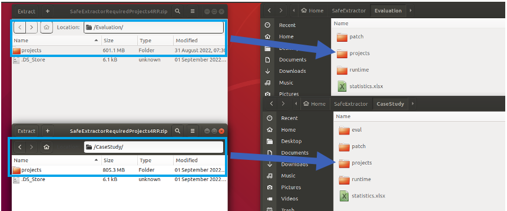

Move `/CaseStudy/projects` folder to `SafeExtractor/Evaluation/projects`.

Move `/Evaluation/projects` folder to `SafeExtractor/CaseStudy/projects`.

### 3. Import replication package into Eclipse IDE for Eclipse Committers
 
Open Eclipse and import **Implementation/SafeExtractor** into Workspace.

Click `File` ... `Import`, then selected as flollows:

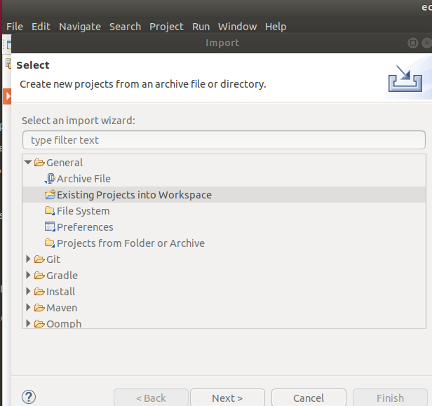

Select directory(path to **Implementation/SafeExtractor**) and Click `Finish`

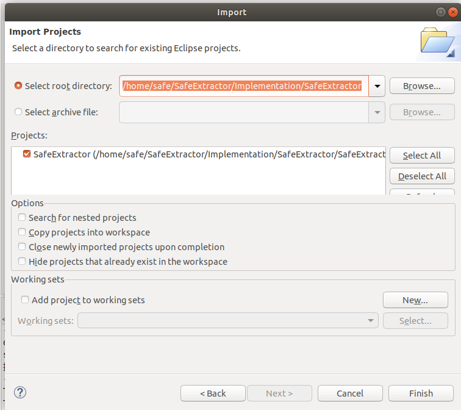

### 4. Configure Path

Open `Constrants.java`(Locate in `safeextractor.utils` package) and modify `Project_Path`(path to **Implementation/SafeExtractor**), `EXP1_ROOT`(the root path of the generated result in Case Study part) and `EXP2_ROOT`(the root path of the generated result in Evaluation part) 

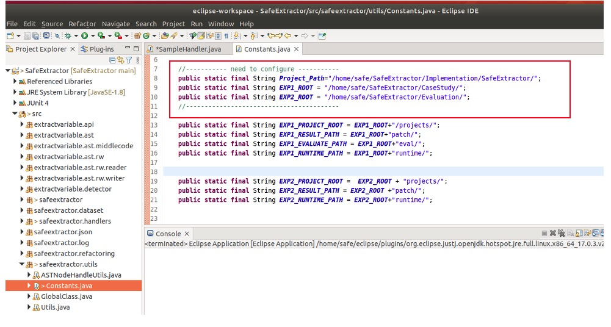 

Note: please make sure all the paths end with `/`

### 5. Run as an Eclipse Application

Run SafeExtractor as an Eclipse Application

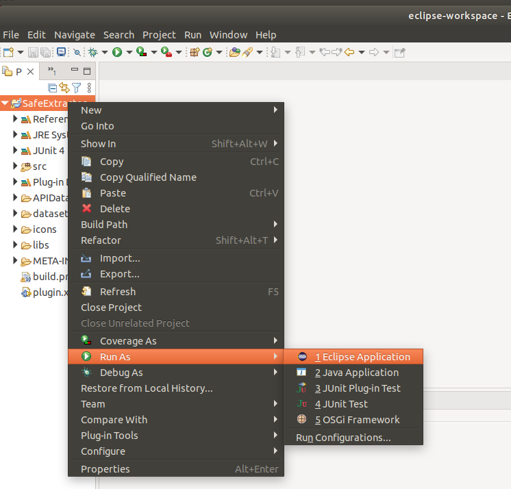 

 

### 6. Reproduce Evaluation

We take project "Mockito" as an example to show how to reproduce evaluation.

#### 6.1 Import Test Project

Click `Create a project` or Open `File` ... `New` ... `Project`
Configure Location as follows, abd Click `Finish`:

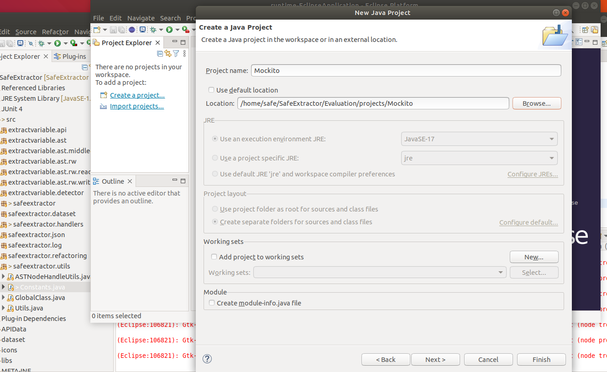 

#### 6.2 Run the Plugin

Open `Replicate` and Click `Extract Variables`

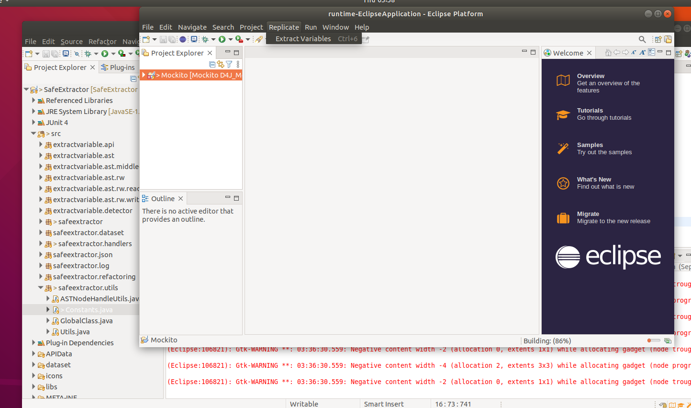

#### 6.3 Manually Specify Replication of Evaluation

The evaluation and case study have different running models. In the evaluation part, we should try all repetitive expressions whereas in the case study we should only try such refactorings discovered from evolution history. To this end, you should let the tool known what you want to replicate and which test project you want to replicate. 

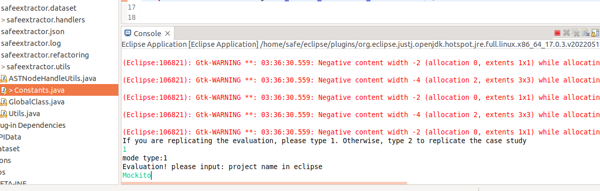

#### 6.4 Outputs of the Replication

After execution, the following windprow will pop up:

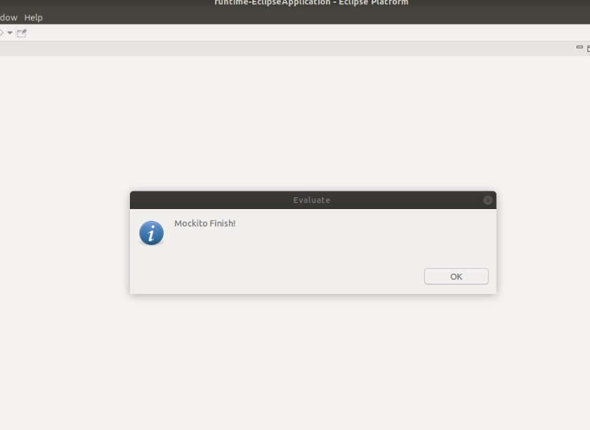

All the generated Result will be show as follows. 
`patch` folder contains three parts, the result of eclipse execution(`patch/Mockito/eclipse`), the result of our approach execution(`patch/Mockito/ours`), and the result of the comparison between the two(`patch/Mockito/compare`), all of which are stored in the form of `patch`.

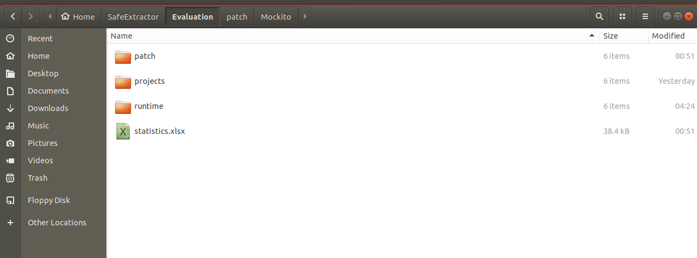
<!--    -->

For example, these are the results of `patch/Mockito/ours` folder
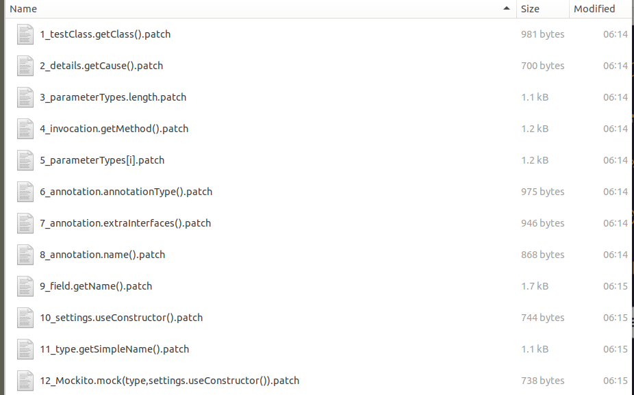

`runtime` folder contains the runtime of the eclipse/our approach for each refactoring in milliseconds.

Note: file `statistics.xlsx` is obtained after we manually labeled the refactoring results of Eclipse/SafeExtractor, rather than automatically generated.

### 7. Reproduce Case Study
 
We take project `Codec` as an example to show how to reproduce evaluation. 

#### 7.1 Import Test Project

Click `Create a project` or Open `File` ... `New` ... `Project`
Configure Location as follows, abd Click `Finish`:

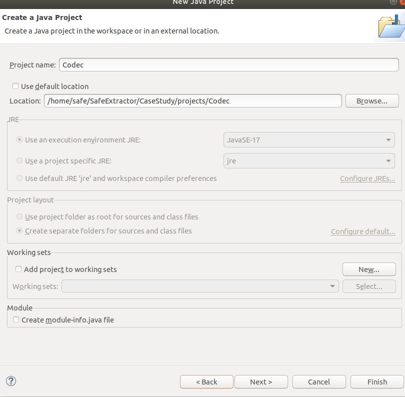 

#### 7.2 Run the Plugin

Open `Replicate` and Click `Extract Variables`

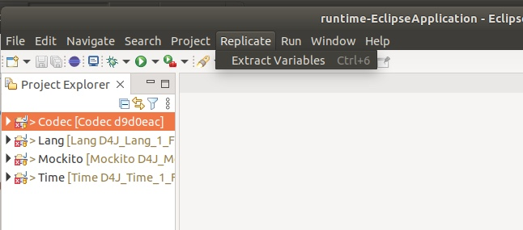

#### 7.3 Manually Specify Replication of Case Study

The evaluation and case study have different running models. In the evaluation part, we should try all repetitive expressions whereas in the case study we should only try such refactorings discovered from evolution history. To this end, you should let the tool known what you want to replicate and which test project you want to replicate. 

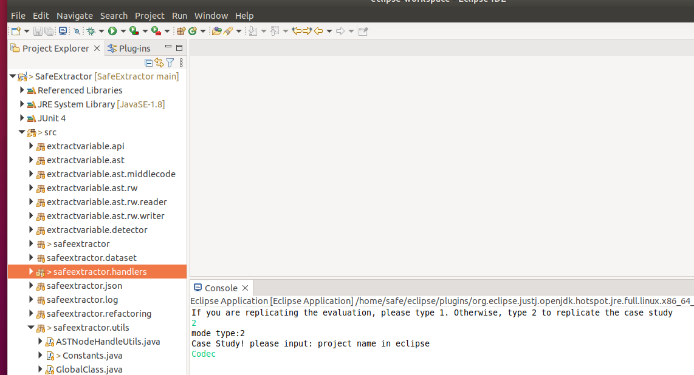

#### 7.4  Outputs of the Replication

After execution, the following window will pop up:

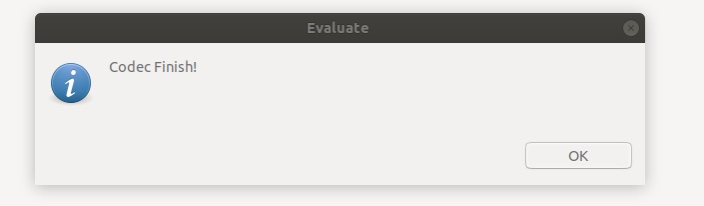

All the Result will be show as follows:

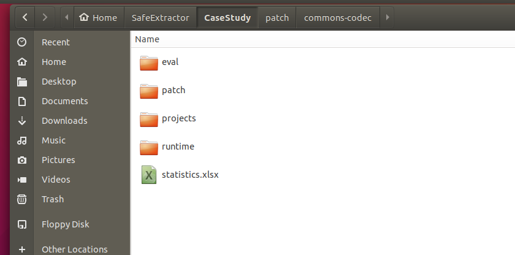

`patch` folder contains three parts, the result of eclipse execution(`patch/commons-codec/eclipse`), the result of our approach execution(`patch/commons-codec/ours`), and the result of the comparison between the two(`patch/commons-codec/compare`), all of which are stored in the form of `patch`.

For example, these are the results of `patch/commons-codec/ours` folder.

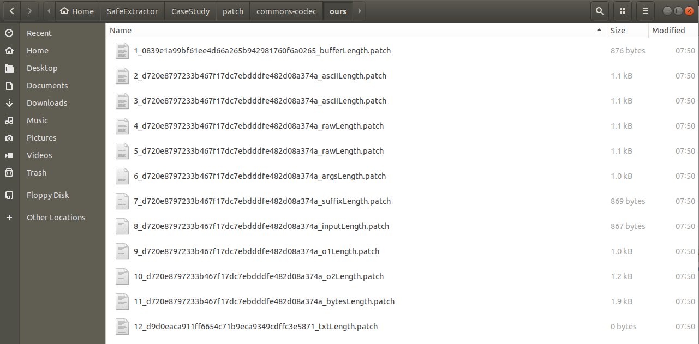

`eval` folder contains the evaluation of the eclipse/our approach compared with the ground truth. Notably, `1` presents consistent, `0` presents inconsistent. Notably, sometimes the ground truth is incorrect, so `0` does not equivalent to imperfect/buggy.
 
`runtime` folder contains the runtime of the eclipse/our approach for each refactoring in milliseconds. 

Note: file `statistics.xlsx` is obtained after we manually checked the refactoring results of Eclipse/SafeExtractor based on `eval` floder, rather than automatically generated.

# Preconditions
FULL CONDITIONS when a set of literally identical expressions could be extracted by an extract variable refactoring:\
$exps$ represents all expressions to be extracted, $name$ represents the name of the new variable, $p$ represents the program where $exps$ appear, and $loc$ represents the location where the new variable should be declared and initialized:
 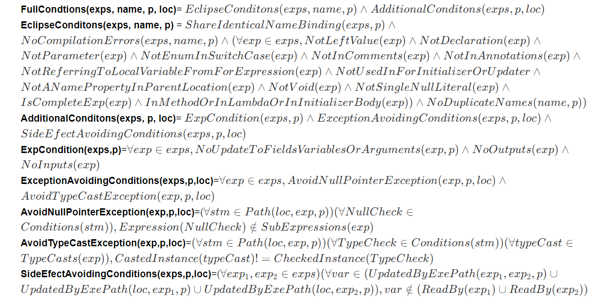
